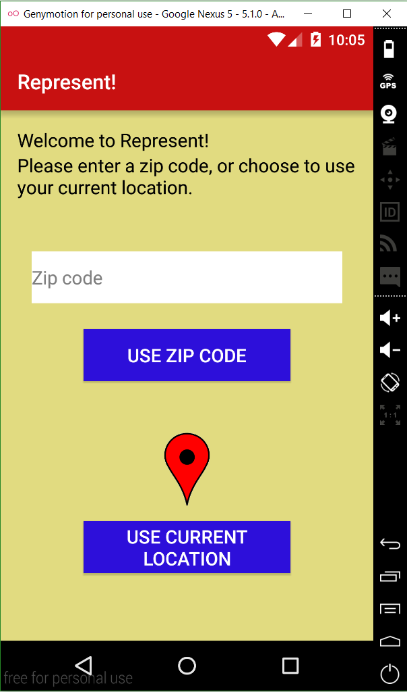
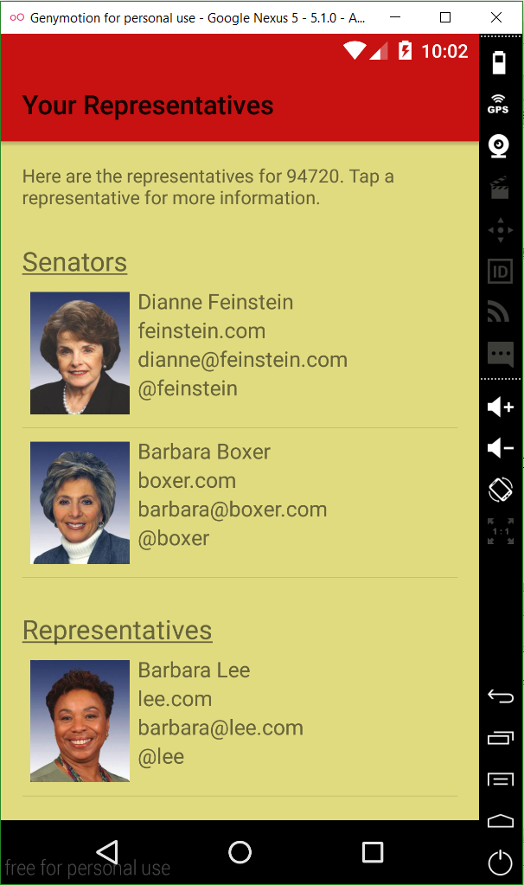
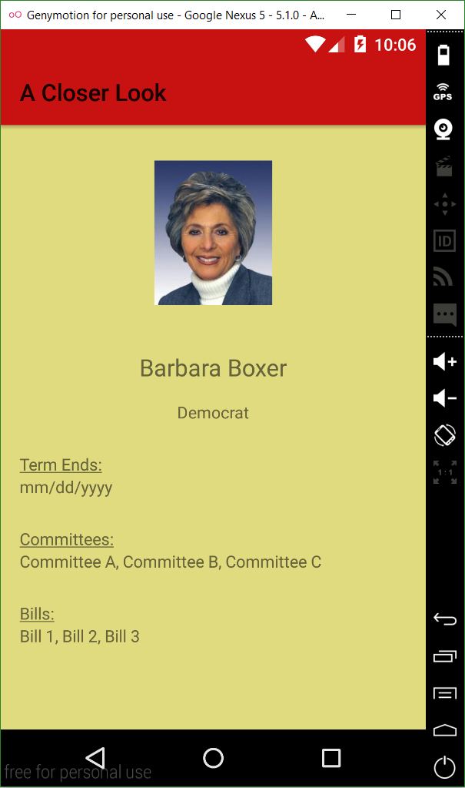
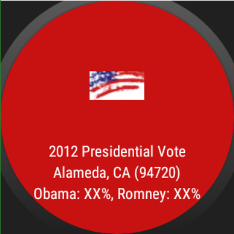

# PROG 02: Represent!

Represent! is an app that allows users to get to know their congressional representatives. Upon selecting a zip code (either by entering one or by using one's current location), the user can see the congresspersons who represent the area and get detailed information about them. 

## Authors

Nathaniel Low ([low.nathaniel@berkeley.edu](mailto:low.nathaniel@berkeley.edu))

## Demo Video

See [Represent! (CS160; PROG02-B)] (https://www.youtube.com/watch?v=O4OsFUTP4vs&feature=youtu.be&hd=1)

## Screenshots

## Acknowledgments

* Jack Thakar 
* Tapas Behera
* peceps
* ishu 
