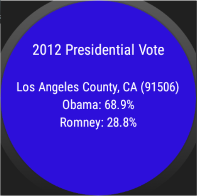

# PROG 02: Represent!

Represent! is an app that allows users to get to know their congressional representatives. Upon selecting a zip code (either by entering one or by using one's current location), the user can see the congresspersons who represent the area and get detailed information about them. 

## Authors

Nathaniel Low ([low.nathaniel@berkeley.edu](mailto:low.nathaniel@berkeley.edu))

## Demo Video

See [Represent! (CS160; PROG02-B)] (https://www.youtube.com/watch?v=O4OsFUTP4vs&feature=youtu.be&hd=1)

## Screenshots

## Acknowledgments and Sources 

* Jack Thakar 
* Jeff Tan
* Tapas Behera (http://www.sprima.com/blog/?p=144) (https://github.com/tapasb/ImagineAir)
* peceps (http://stackoverflow.com/questions/2317428/android-i-want-to-shake-it)
* ishu (http://stackoverflow.com/questions/16333754/how-to-customize-listview-using-baseadapter)
* Ben Jakuben (http://stackoverflow.com/questions/2317428/android-i-want-to-shake-it)
* Obaro Ogbo (http://www.androidauthority.com/use-remote-web-api-within-android-app-617869/) (https://github.com/obaro/SimpleWebAPI/blob/master/app/src/main/java/com/sample/foo/simplewebapi/MainActivity.java)
* http://stackoverflow.com/questions/3641304/get-latitude-and-longitude-using-zipcode
* 

