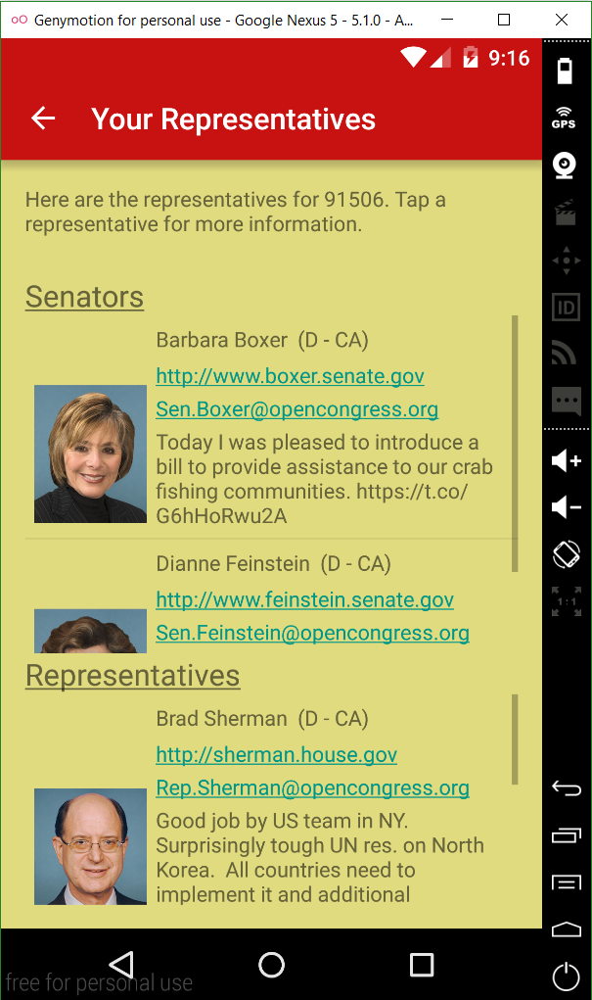
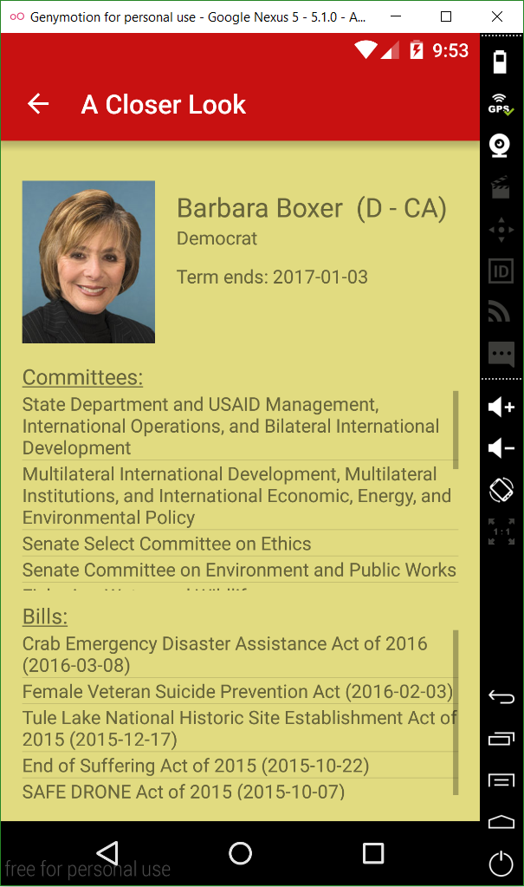

# PROG 02: Represent!

Represent! is an app that allows users to get to know their congressional representatives. Upon selecting a zip code (either by entering one or by using one's current location), the user can see the congresspersons who represent the area and get detailed information about them. The user can also see information about the 2012 presidential election for the location they have chosen.  

## Authors

Nathaniel Low ([low.nathaniel@berkeley.edu](mailto:low.nathaniel@berkeley.edu))

## Demo Video

See [Represent! (CS160; PROG02-C)] (http://youtu.be/woGTydXv0I0?hd=1)

## Screenshots

## Acknowledgments and Sources 

* Jack Thakar 
* Jeff Tan
* Tapas Behera (http://www.sprima.com/blog/?p=144) (https://github.com/tapasb/ImagineAir)
* peceps (http://stackoverflow.com/questions/2317428/android-i-want-to-shake-it)
* ishu (http://stackoverflow.com/questions/16333754/how-to-customize-listview-using-baseadapter)
* Ben Jakuben (http://stackoverflow.com/questions/2317428/android-i-want-to-shake-it)
* Obaro Ogbo (http://www.androidauthority.com/use-remote-web-api-within-android-app-617869/) (https://github.com/obaro/SimpleWebAPI/blob/master/app/src/main/java/com/sample/foo/simplewebapi/MainActivity.java)
* Gabriele Mariotti (https://gist.github.com/gabrielemariotti/ca2d0a9f79b902b19a65) 
* http://stackoverflow.com/questions/3641304/get-latitude-and-longitude-using-zipcode
* http://stackoverflow.com/questions/6343166/how-to-fix-android-os-networkonmainthreadexception?page=1&tab=votes#tab-top
* http://stackoverflow.com/questions/3828111/is-there-a-way-to-show-the-scrollbar-of-listview-all-the-time
* https://dev.twitter.com/rest/reference/get/statuses/user_timeline
* http://stackoverflow.com/questions/9290651/make-a-hyperlink-textview-in-android
* https://twittercommunity.com/t/test-run-with-fabric-android/60673
* http://pages.cs.wisc.edu/~hasti/cs302/examples/Parsing/parseString.html

